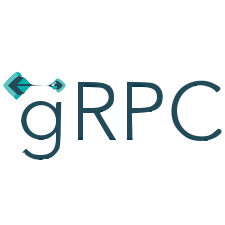

<div align="center">
  
</div>

<div align="center">
  <a href="#about">About</a>
   &nbsp;&nbsp;&nbsp;|&nbsp;&nbsp;&nbsp;
  <a href="#client-commands">Client commands</a>
  &nbsp;&nbsp;&nbsp;|&nbsp;&nbsp;&nbsp;
  <a href="#run-with-go-command">Run with go command</a>
  &nbsp;&nbsp;&nbsp;|&nbsp;&nbsp;&nbsp;
  <a href="#run-with-docker">Run with Docker</a>
  &nbsp;&nbsp;&nbsp;|&nbsp;&nbsp;&nbsp;
  <a href="#license">License</a>
</div>

## About

Simple gRPC Key–value storage application

## Client commands

`put [key] [value]` - Put a entry

`get [key]` - Get value of key

`getAllKeys` - Get all keys

Commands were made with [Cobra](https://github.com/spf13/cobra)

## Run with go command

### Server - Navigate to folder

```sh
cd server
```

### Server - Install dependencies

```sh
go mod vendor
```

### Server - Run application

```sh
go run main.go
```

### Client - Navigate to folder

```sh
cd client
```

### Client - Install dependencies

```sh
go mod vendor
```

### Client - Run application

```sh
go run main.go
```

## Run with Docker

### Authenticate to GitHub Packages

```sh
echo <READ_PACKAGES_TOKEN> | docker login docker.pkg.github.com -u <USERNAME> --password-stdin
```

### Pull Docker images

```sh
docker pull docker.pkg.github.com/puc-disciplinas/kv-grpc-gamoch-ianbandrade/server
docker pull docker.pkg.github.com/puc-disciplinas/kv-grpc-gamoch-ianbandrade/client
```

### Rename Docker images

```sh
docker tag docker.pkg.github.com/puc-disciplinas/kv-grpc-gamoch-ianbandrade/server kv-server
docker tag docker.pkg.github.com/puc-disciplinas/kv-grpc-gamoch-ianbandrade/client kv-client
```

### Run server

```sh
docker run -it --rm --net host kv-server
```

### Run client

```sh
docker run -it --rm --net host kv-client
```

## License

This project is under the MIT license. See the file [LICENSE](LICENSE) for more details.
